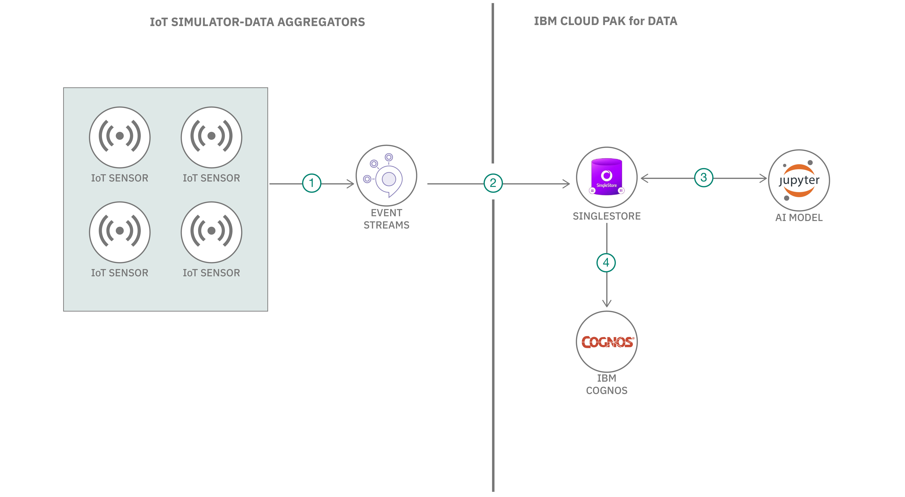
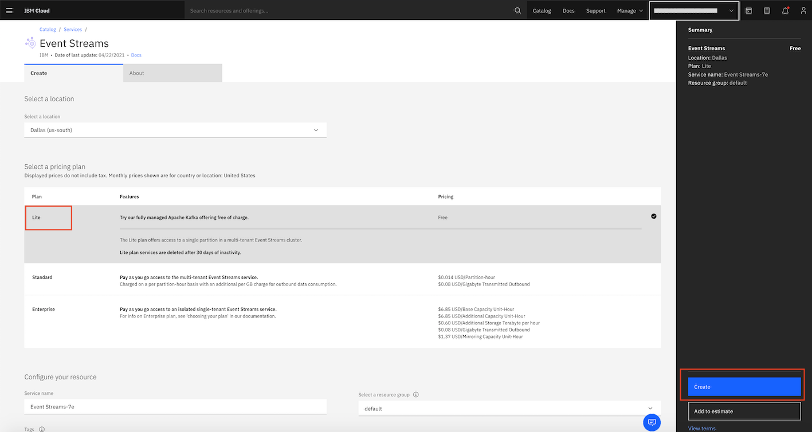
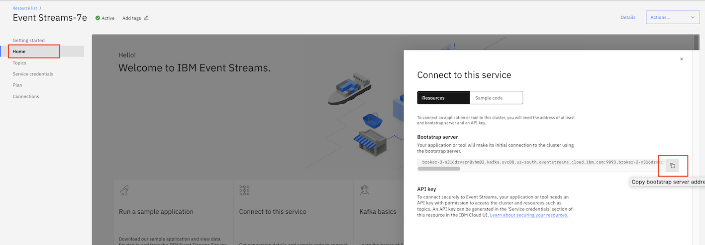
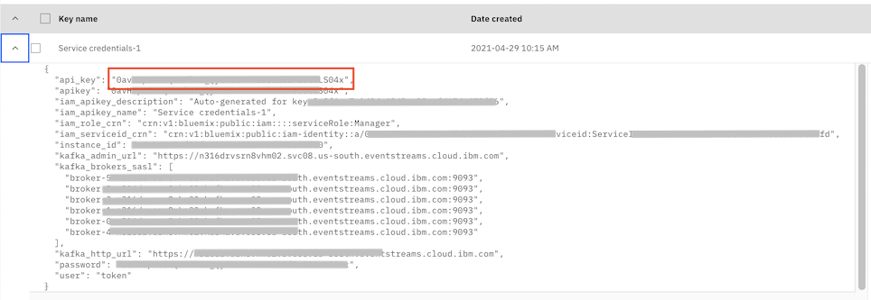

# (WORK IN PROGRESS)


# Detect anamolies in streaming IoT data using EventStreams and Singlestore database on Cloud Pak for Data
In this code pattern, you will see how to detect anamolies in IoT event streams using IBM Event Streams and IBM Cloud Pak for Data with [Singlestore](https://www.singlestore.com/) database. 


## Flow




## Prerequisites
1. [IBM Cloud Account](https://cloud.ibm.com)
1. [IBM Cloud Pak for Data](https://cloud.ibm.com/catalog/content/ibm-cp-datacore-6825cc5d-dbf8-4ba2-ad98-690e6f221701-global)
1. [Install Singlestore database on Cloud Pak for Data](https://docs.singlestore.com/v7.3/reference/memsql-operator-reference/additional-deployment-methods/helm-chart-for-ibm-cloud-pak-for-data/)
1. [Java](https://www.java.com/en/)
1. [Gradle](https://gradle.org/)

## Steps

1. [Create an instance of IBM Event Streams](#1-create-an-instance-of-ibm-event-streams)
1. [Note broker urls](#2-note-broker-urls)
1. [Create credentials](#3-create-credentials)
1. [Download the SSL certificate from Event Streams](#4-download-the-ssl-certificate-from-event-streams)
1. [Upload the certificate to the Singlestore cluster](#5-upload-the-certificate-to-the-singlestore)
1. [Create a database, table and pipeline](#6-create-a-database-table-and-pipeline)
1. [Clone the repo](#7-clone-the-repo)
1. [Build and run the application](#8-build-and-run-the-application)

## 1. Create an instance of IBM Event Streams

Click [here](https://cloud.ibm.com/catalog/services/event-streams) to create an instance of Event Streams.
Select `Lite` plan and click `Create`.



## 2. Note broker urls

Select `Home` on the menu and click on the paste icon to copy the comma separated broker urls.



>Note: The URLs will be needed to download the Event Streams SSL certificate and also to run the producer application

## 3. Create credentials

Select `Credentials` on the menu and click `New Credential`.


In the newly created credential, note the api key:



## 4. Download the SSL certificate from Event Streams

Open a terminal and run the below command after replacing `[broker-xxx-eventstreams.cloud.ibm.com:9093]` with one of the broker URLs noted earlier:
```
openssl s_client -connect [broker-xxx-eventstreams.cloud.ibm.com:9093] -servername [broker-xxx-eventstreams.cloud.ibm.com:9093] -showcerts > evtstreams.pem
```
The Event Streams certificate will be stored in a file `evtstreams.pem`.

## 5. Upload the certificate to the Singlestore cluster

Login to the Cloud Pak For Data cluster:

```
oc login --token=[token] --server=[url]
```

Create a secret for the Event Streams certificate after specifying the path to the directory that contains the `evtstreams.pem` that you downloaded earlier:
```
kubectl create secret generic node-memsql-cluster-master-0-additional-secrets --from-file=[Path to the directory where evtstreams.pem is downloaded]
```

## 6. Create a database, table and pipeline

Run the below command to open the SingleStore container shell:
```
kubectl exec -it node-memsql-cluster-master-0 /bin/bash
```

Login to the SingleStore DB with the credentials noted earlier:
```
memsql -u [username] -p[password]
```

### Create a new database

Run the below command to create a new database - `iotprediction`.

```
create database iotprediction;
use iotprediction;
```

### Create a table to store temperature data

Run the below command to create the table:
```
CREATE TABLE `data` (`id` int(11) DEFAULT NULL,`read_dt` datetime DEFAULT NULL,`temperature` int(4) DEFAULT NULL);
```

### Create a pipeline to consume data from Event Streams

Run the below command to create the pipeline after replacing the [Broker 0 URL] with the `broker-0` url we noted earlier(For example: `broker-0-xxx.kafka.svc08.us-south.eventstreams.cloud.ibm.com:9093`) and [API Key] with the api_key we noted earlier from credential:
```
CREATE PIPELINE `temperature_pipeline` AS LOAD DATA KAFKA '[Broker 0 URL]/tempreads' CONFIG '{"security.protocol": "sasl_ssl","sasl.mechanism": "PLAIN","ssl.certificate.location": "/etc/memsql/extra-secret/evtstreams.pem","sasl.username":"token"}' CREDENTIALS '{"ssl.key.password": "null","sasl.password": "[API Key]"}' INTO table data;
```

## 7. Clone the repo

Open a terminal and run the below command to clone the repo:
```
git clone https://github.com/IBM/anamoly-prediction-streams-singlestore-cp4d
```
## 8. Build and run the application

Change the directory:
```
cd sources/java/event-streams-producer-client/
```


Run the below command to build the application:
```
gradle clean build
```

Run the below command after replacing the [kafka_brokers_sasl] and [api_key] you noted earlier:
```
java -jar ./build/libs/event-streams-producer-client-2.0.jar [kafka_brokers_sasl] [api_key] -producer
```

>Note: The kafka_brokers_sasl must be formatted as "host:port,host2:port2". If not, format the contents of kafka_brokers_sasl in a text editor before entering it in the command line.
